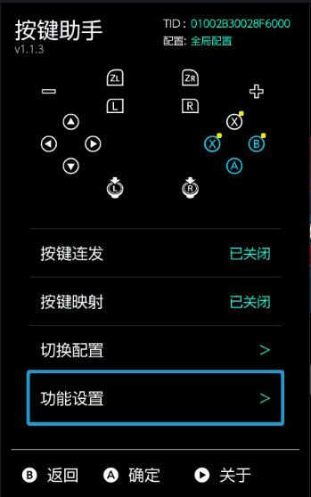

[🇨🇳 中文](#中文) | [EN English](#english)

https://github.com/user-attachments/assets/2540f1d5-5294-489f-b85a-4b96806365bc

---

<a name="中文"></a>
# 中文

**如果你对通知模块感兴趣，可以访问 [通知模块](https://github.com/TOM-BadEN/NX-Notification) NX-Notification**

## 注意

- 映射功能全机型支持
- **连发功能仅支持LITE机型**

# KeyX 按键助手

Nintendo Switch 按键助手，支持连发与按键重新分配，拥有全局或游戏独立配置，根据记忆自动启动功能。
由特斯拉插件与系统模块两部分组成。

## 功能



- 美观现代的特斯拉插件
- 特斯拉插件可动态修改连发与映射按键
- 可选择开启的现代UI设计的通知弹窗

### 按键映射

- 支持 16 个按键互相映射 (A/B/X/Y/L/R/ZL/ZR/十字键/SELECT/START/L3/R3)
- 与连发功能可同时启用，不会有冲突
- **完美避开系统关于按键修改后的警告弹窗**
- 全局配置和游戏独立配置
- 自动记忆开关状态

### 按键连发 (仅支持LITE)

- 支持 12 个按键连发（A/B/X/Y/L/R/ZL/ZR/十字键）
- 支持多个按键同时连发
- 连发时支持非连发键正常使用
- 可设置按下和松开时长
- 全局配置和游戏独立配置
- 自动记忆开关状态


## 内存占用

- 系统模块仅占用 297 KB
- 弹窗额外占用 688 KB
- **弹窗只有触发的时候才有内存占用**

## 安装

将文件复制到 SD 卡根目录：
```
/atmosphere/contents/4100000002025924/
/atmosphere/contents/0100000000251020
/switch/.overlays/ovl-KeyX.ovl
```

## 多语言

- Chinese is hardcoded, no need to add
- I used AI to translate the English language file. 
- I don't understand other languages, and AI is even worse at it
- You can refer to en.json to add support for other languages

```
SUPPORTED LANGUAGES:
  - en.json       (English)
  - zh-cn.json    (No need to add, already hardcoded)
  - zh-tw.json    (Traditional Chinese)
  - ja.json       (Japanese)
  - ko.json       (Korean)
  - fr.json       (French)
  - de.json       (German)
  - it.json       (Italian)
  - es.json       (Spanish)
  - pt.json       (Portuguese)
  - ru.json       (Russian)
  - nl.json       (Dutch)
```

## 编译

```bash
cd sys-KeyX && make -j
cd ovl-KeyX && make -j
```
或者直接根目录

```bash
cd KeyX && make
```

## 许可证

MIT License

本项目仅供学习和研究使用。

## 感谢

- [libnx](https://github.com/switchbrew/libnx) - Switch 开发库
- [libultrahand](https://github.com/ppkantorski/libultrahand) - Tesla Overlay 框架
- [minIni-nx](https://github.com/ITotalJustice/minIni-nx) - INI 配置文件解析库


---

<a name="english"></a>
# English

**If you are interested in the notification module, visit [NX-Notification](https://github.com/TOM-BadEN/NX-Notification)**

## Notice

- Key mapping works on all Switch models
- **Turbo (auto-fire) only works on LITE models**

# KeyX Button Assistant

Nintendo Switch button assistant with turbo and key remapping support. Features global or per-game configuration with auto-start memory.
Consists of Tesla overlay and system module.

## Features


- Modern and beautiful Tesla overlay
- Dynamically modify turbo and mapping settings
- Optional modern UI notification popups

### Key Mapping

- Remap 16 buttons (A/B/X/Y/L/R/ZL/ZR/D-pad/SELECT/START/L3/R3)
- Works together with turbo without conflicts
- **Perfectly avoids system warning popups about button changes**
- Global and per-game configuration
- Auto-remembers on/off state

### Turbo (LITE Only)

- Turbo for 12 buttons (A/B/X/Y/L/R/ZL/ZR/D-pad)
- Multiple buttons can turbo simultaneously
- Non-turbo buttons work normally during turbo
- Customizable press and release duration
- Global and per-game configuration
- Auto-remembers on/off state

## Memory Usage

- System module: only 297 KB
- Notification popup: extra 688 KB
- **Popup only uses memory when triggered**

## Installation

Copy files to SD card root:
```
/atmosphere/contents/4100000002025924/
/atmosphere/contents/0100000000251020
/switch/.overlays/ovl-KeyX.ovl
```

## Multi-Language

- Chinese is hardcoded, no need to add
- I used AI to translate the English language file
- I don't understand other languages, and AI is even worse at it
- You can refer to en.json to add support for other languages

```
SUPPORTED LANGUAGES:
  - en.json       (English)
  - zh-cn.json    (No need to add, already hardcoded)
  - zh-tw.json    (Traditional Chinese)
  - ja.json       (Japanese)
  - ko.json       (Korean)
  - fr.json       (French)
  - de.json       (German)
  - it.json       (Italian)
  - es.json       (Spanish)
  - pt.json       (Portuguese)
  - ru.json       (Russian)
  - nl.json       (Dutch)
```

## Build

```bash
cd sys-KeyX && make -j
cd ovl-KeyX && make -j
```
Or from root directory:

```bash
cd KeyX && make
```

## License

MIT License

This project is for learning and research purposes only.

## Credits

- [libnx](https://github.com/switchbrew/libnx) - Switch development library
- [libultrahand](https://github.com/ppkantorski/libultrahand) - Tesla Overlay framework
- [minIni-nx](https://github.com/ITotalJustice/minIni-nx) - INI config parser library
